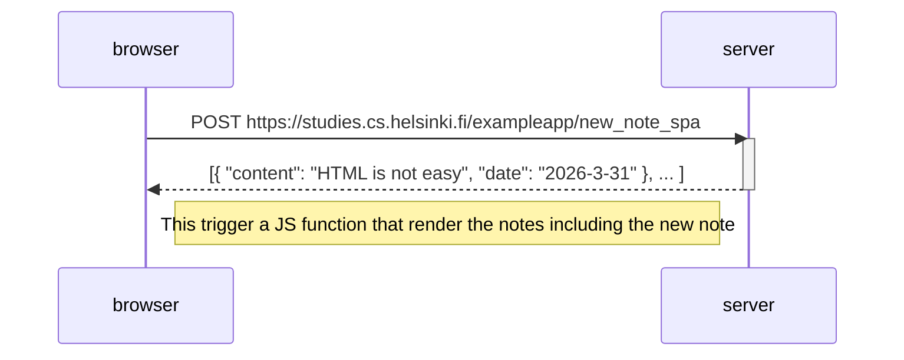

```mermaid
sequenceDiagram
    participant browser
    participant server

    browser->>server: POST https://studies.cs.helsinki.fi/exampleapp/new_note_spa
    activate server
    server-->>browser: [{ "content": "HTML is not easy", "date": "2026-3-31" }, ... ]
    deactivate server

    Note right of browser: This trigger a JS function that render the notes including the new note
```